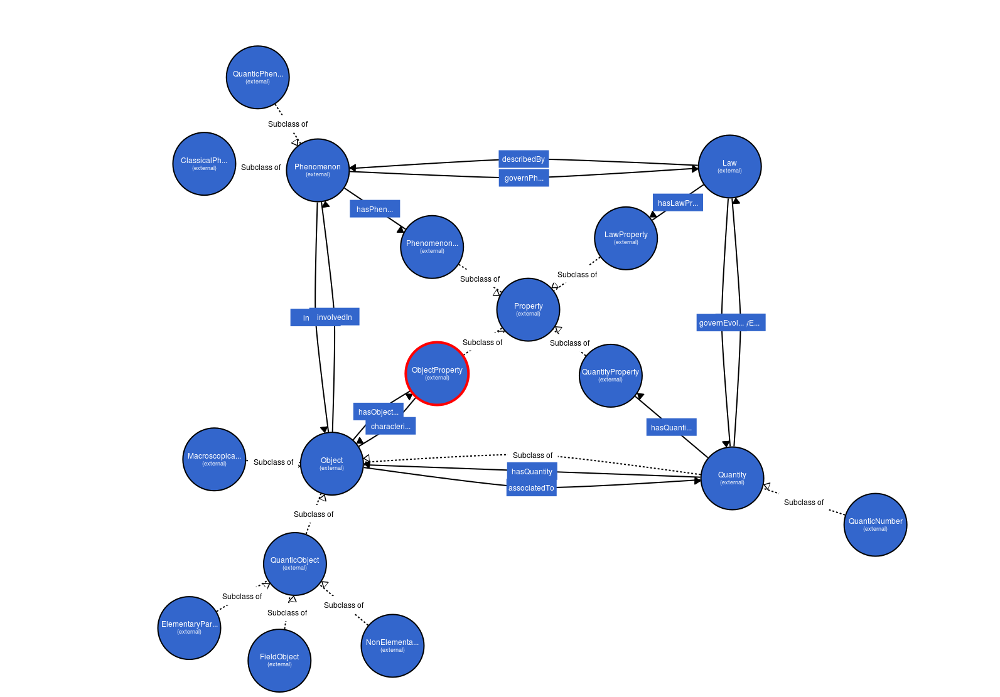

---
title: Project PSO (Physical Sciences Ontology)
...

## Project definition

Creation of an ontology for the description of Physical Sciences.

## Last released version

[version-0.0.1](../../ontology/pso.owl)

### Graph visualisation

<a href="http://vowl.visualdataweb.org/webvowl/index.html#iri=http://jibe-b.github.io/ontology/pso/pso.owl">Interactive visualisation</img></a>

### Tree visualisation

<a href="http://opendata1.opendata.u-psud.fr:8080/webprotege/#Edit:projectId=27a08a93-6a87-4d3d-a018-a6c8212fb414">Webprotégé</img></a>

## Development Notebook

[Carnet](pso-notebook.html)

## Associated RDF graph

In the creation workflow of the ontology, RDF triples ar written. They will soon be displayed here.

## Article de présentation

[Article (début d'écriture prochainement)](https://www.authorea.com/users/5676/articles/14396/_show_article) sur Authorea.

## Documentation

[Bibliographie et sources](https://www.zotero.org/groups/pso/items)

[Annotation de la bibliographie](annotated-bibliography.png)

## Motivations for this project

Le développement des technologies du web sémantique permet une gestion des données plus riche et plus rigoureuse que le simple stockage dans des bases de données relationnelles. Le développement d'ontologies (description formelle des relations entre concepts) permet 

l'interopérabilité entre les jeux de donnée, la visualisation et l'étude des relations entre concepts.

Les ontologies sont nombreuses en biologie (plus de 300 sur [Bioportal](http://bioportal.bioontology.org/)) mais peu d'ontologies ont été développées en sciences physiques.

Ce projet consiste donc dans le développement d'une ontologie de description des sciences physiques.

### Préambule

L'objectif de cette documentation est de présenter les axes de développement, les sources d'inspiration et les justifications des choix. En d'autres termes, tout ce qui n'est pas rendu explicite dans le fichier OWL produit.

Dans les commentaires liés à chaque classe et chaque propriété se trouvent des informations, en particulier la source et une justification succinte de l'existence de cette classe/propriété, sa place dans l'arbre des classes/propriétés, ainsi que la combinatoire, la cardinalité, domaine et range.

Ces justifications dans le fichier OWL sont liées à celles présentées dans la documentation associée au fichier OWL.

### Lignes directrices

Il s'agit de réaliser une ontologie généraliste appliquée aux sciences physiques. À cette ontologie
devront pouvoir être greffées des ontologies spécifiques à chaque domaine de sciences physiques.

### Utilisations possibles de cette ontologie

* Production de ressources éducatives en Linked Data, basées sur cette ontologie
* données de recherche en Linked Data

### Équipe

* Jibé Bohuon (université Paris Sud)
* partenariats en cours d'établissement
* projet ouvert aux participations

### Roadmap

1. Acquisition de compétences (RDF, OWL, théorie des ontologies)
et recencement des concepts et relations entre concepts

2. Réalisation d'une ontologie
